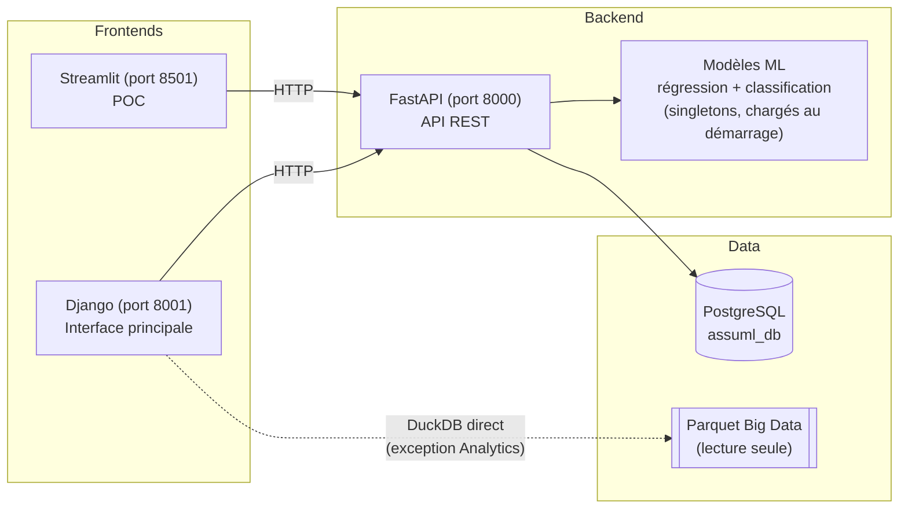

# AssuML

**Plateforme de scoring assurance santé pilotée par Machine Learning** — prédiction du coût médical annuel, catégorisation du risque et calcul de prime, avec une interface de gestion complète pour l'assureur et l'assuré.

Projet réalisé dans le cadre de la certification RNCP37827 *Développeur en Intelligence Artificielle* (Simplon).

[](https://github.com/Leozmee/AssuML/actions/workflows/ci.yml)

---

## Sommaire

- [À propos](#à-propos)
- [Architecture](#architecture)
- [Stack technique](#stack-technique)
- [Fonctionnalités](#fonctionnalités)
- [Démarrage rapide](#démarrage-rapide-docker)
- [Démarrage en local (dev)](#démarrage-en-local-dev)
- [Variables d'environnement](#variables-denvironnement)
- [Tests & qualité](#tests--qualité)
- [CI/CD](#cicd)
- [Modèles ML & MLflow](#modèles-ml--mlflow)
- [Pipeline ETL](#pipeline-etl)
- [Accessibilité & RGPD](#accessibilité--rgpd)
- [Structure du projet](#structure-du-projet)
- [Documentation complémentaire](#documentation-complémentaire)

---

## À propos

AssuML simule le système d'information d'un assureur santé : à partir du profil d'un client (âge, IMC, tabagisme, région, enfants...), deux modèles de Machine Learning prédisent en direct le **coût médical annuel** et la **catégorie de risque**, à partir desquels une règle métier calcule la **prime** proposée. L'ensemble du flux — de la donnée brute à la décision assureur — est exposé via une API REST et deux interfaces web (une interface principale Django, un POC Streamlit conservé).

Le projet couvre l'intégralité de la chaîne data/IA : exploration et feature engineering, entraînement et suivi de modèles (MLflow), pipeline ETL multi-sources, base de données relationnelle, API de service, CI/CD, monitoring, accessibilité (WCAG/RGAA) et conformité RGPD.

## Architecture



Règle d'architecture centrale : **Django et Streamlit ne parlent jamais directement à la base de données** — tout passe par l'API FastAPI (`django_app/utils/api_client.py` est la seule couche HTTP côté Django). Seule exception assumée : le module Analytics interroge DuckDB directement sur le fichier Parquet Big Data (lecture seule, 5M lignes), pour des raisons de performance.

## Stack technique

| Couche | Technologies |
| --- | --- |
| **Backend / API** | Python 3.11, FastAPI, Pydantic v2, SQLAlchemy 2.0, Uvicorn |
| **Frontend principal** | Django 5.2, Bootstrap 5, Plotly.js |
| **Frontend POC** | Streamlit, Plotly Express |
| **Base de données** | PostgreSQL 15, DuckDB (lecture seule Parquet) |
| **Machine Learning** | scikit-learn, Pandas, NumPy, Joblib |
| **MLOps** | MLflow (Tracking + Model Registry, alias `production`, gate anti-régression) |
| **ETL** | Requests, BeautifulSoup4, OpenWeatherMap API, SQLite (source externe) |
| **Tests** | pytest, pytest-django, pytest-asyncio, httpx |
| **Qualité** | flake8, black |
| **CI/CD** | GitHub Actions (5 jobs), Docker, Docker Compose |
| **Déploiement** | Railway |
| **Monitoring** | Panneau Monitoring intégré à Django (santé API, métriques modèles, KPIs) + observabilité infra native Railway (logs, métriques CPU/RAM, historique de déploiement) |

## Fonctionnalités

- **Scoring ML** — simulation en direct (sélection d'un client existant ou saisie manuelle), double prédiction régression/classification, calcul de prime avec marge de risque.
- **Gestion clients** — CRUD complet, gestion des contrats (création/résiliation/réactivation), soft delete, export RGPD des données personnelles, détection des primes obsolètes après modification du profil.
- **Analytics Big Data** — KPIs et visualisations sur 5M de profils synthétiques (DuckDB/Parquet), panneau "Contexte régional" croisant Big Data, météo temps réel et statistiques de santé publique.
- **Monitoring** — santé de l'API, métriques des modèles ML déployés (lues depuis `metadata.json`, source de vérité versionnée), KPIs portefeuille.
- **Authentification double rôle** — assureur (admin) / assuré (user), inscription, changement de mot de passe, espace "Mon compte" avec historique des évaluations.
- **Actualités** — agrégation d'articles santé/assurance via scraping.

## Démarrage rapide (Docker)

```bash
git clone https://github.com/Leozmee/AssuML.git
cd AssuML

# 1. Config : copie du modèle .env.example vers .env (à éditer avec vos
#    propres valeurs — voir le tableau "Variables d'environnement" plus bas)
cp .env.example .env

# 2. Build + démarrage : construit les images de tous les services à partir
#    de leurs Dockerfile (équivalent de `docker compose build` +
#    `docker compose up` en une seule commande), puis démarre les conteneurs
docker compose up --build
```

Au démarrage, les conteneurs s'enchaînent dans cet ordre de dépendance (`depends_on` dans `docker-compose.yml`) : `postgres` → `seed` (peuple `regions`/`clients` depuis `data/small_data/insurance.csv`) → `train` (entraîne les 2 modèles ML, car les `.pkl` ne sont jamais commités) → `api` / `django` / `streamlit` / `etl_scheduler`.

| Service | URL |
| --- | --- |
| Django (interface principale) | <http://localhost:8001> |
| API FastAPI (docs Swagger) | <http://localhost:8000/docs> |
| Streamlit (POC) | <http://localhost:8501> |

> La table `predictions` démarre volontairement vide : les modèles ML doivent tourner en direct depuis l'interface (aucune prédiction n'est pré-calculée par un script).

## Démarrage en local (dev)

```bash
# API
uvicorn api.main:app --reload --port 8000

# Frontend principal
python django_app/manage.py runserver 8001

# POC (optionnel)
streamlit run streamlit_app/app.py --server.port 8501
```

Voir [`CLAUDE.md`](./CLAUDE.md) pour l'ensemble des commandes (entraînement des modèles, ETL, Big Data, MLflow UI, qualité de code).

## Variables d'environnement

Copier [`.env.example`](./.env.example) en `.env` :

| Variable | Description |
| --- | --- |
| `DB_HOST`, `DB_PORT`, `DB_NAME`, `DB_USER`, `DB_PASS` | Connexion PostgreSQL |
| `API_KEY` | Clé partagée entre Django/Streamlit et l'API (header `X-API-Key`) |
| `OPENWEATHER_API_KEY` | Source météo de l'ETL (`data_pipeline/extract/api_extractor.py`) |
| `DJANGO_SECRET_KEY` | Clé secrète Django |
| `API_BASE_URL` | URL de l'API vue depuis Django (`http://api:8000` en Docker) |
| `MLFLOW_TRACKING_URI` | `sqlite:///mlflow.db` — aucun serveur MLflow externe requis |

## Tests & qualité

```bash
# Suite principale (API, ML, business, ETL)
pytest tests/ -v

# Suite Django
cd django_app && pytest tests/ -v

# Couverture
pytest --cov=. --cov-report=term-missing

# Lint / formatage
flake8 . --max-line-length=88
black --check .
```

## CI/CD

`.github/workflows/ci.yml` exécute à chaque push/PR : **qualite** (black + flake8), **tests** (unitaires + contrats, après entraînement des modèles), **tests-integration** (API + PostgreSQL réels), **tests-django** (suite Django, après génération du Parquet Big Data), **docker-build** (build des images + validation de `docker-compose.yml`).

## Modèles ML & MLflow

Deux modèles entraînés sur `data/small_data/insurance.csv` (dataset Kaggle Medical Cost Personal, 1 338 lignes) :

| Modèle | Algorithme | Métrique |
| --- | --- | --- |
| Régression (coût médical) | GradientBoostingRegressor | R² ≈ 0.88 |
| Classification (risque) | GradientBoostingClassifier | Accuracy ≈ 0.89 |

Suivi via **MLflow Tracking** (`mlflow.db`, SQLite local) avec **Model Registry** (alias `production`, pas de stages dépréciés) et un **gate anti-régression** (`ml_models/training/mlflow_gate.py`) : un modèle nouvellement entraîné ne remplace le `.pkl` en production que s'il est strictement meilleur que le précédent sur les métriques clés.

```bash
mlflow ui --backend-store-uri sqlite:///mlflow.db   # http://localhost:5000
```

## Pipeline ETL

4 sources de données alimentent PostgreSQL (`data_pipeline/extract/`) :

1. **CSV** — dataset source (`insurance.csv`)
2. **API** — météo temps réel (OpenWeatherMap)
3. **Scraping** — actualités santé/assurance
4. **BDD externe** — statistiques de santé publique régionales (SQLite → PostgreSQL)

## Accessibilité & RGPD

- Audit **WCAG/RGAA** documenté dans [`docs/accessibilite.md`](./docs/accessibilite.md).
- **RGPD** : suppression logique (soft delete, jamais de `DELETE` physique sur les clients), export des données personnelles via    l'espace assuré, page dédiée `/rgpd/`.

## Structure du projet

```text
AssuML/
├── api/               # FastAPI — routers, schémas Pydantic, ORM
├── business/          # Règles métier (calcul de prime, scoring risque)
├── data_pipeline/      # ETL — extract / transform / load (4 sources)
├── data/               # Datasets (small_data committé, big_data généré)
├── database/            # DDL PostgreSQL, seed
├── django_app/          # Frontend principal (accounts, scoring, gestion, analytics, monitoring, actualites)
├── ml_models/            # Entraînement, modèles sauvegardés, prédiction, MLflow gate
├── notebooks/             # Exploration, feature engineering, entraînement et évaluation (Jupyter)
├── streamlit_app/          # Frontend POC
├── big_data/                # Génération du dataset synthétique 5M lignes
├── scripts/                  # Scripts d'exploitation (ETL hebdo, setup BDD)
├── docs/                       # Documentation complémentaire (audit accessibilité)
├── tests/                       # Tests unitaires / intégration / contrats
├── specs/                        # Spécifications par feature (spec-driven development)
└── docker-compose.yml
```


